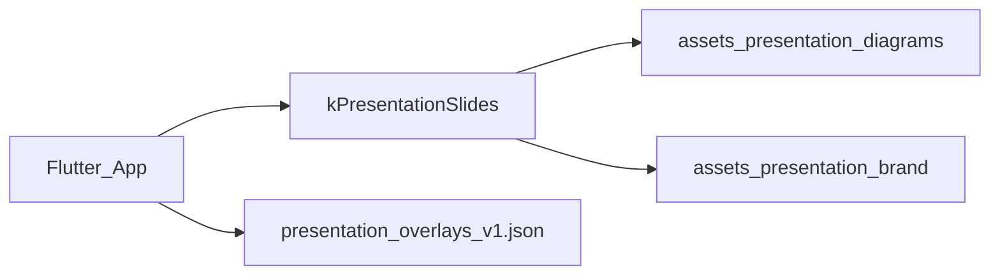

# Presentation.md – Folien-Outline, Demo-Skript & Learnings

Präsentationsleitfaden für **Snackautomat Yakup & Leandro** (`3d_model`).

**Stand:** August 2026 · Standalone Flutter + Power3D/Babylon

**Begleitdocs:** [`Control.md`](Control.md) · [`Dependencies.md`](Dependencies.md) · [`Root.md`](Root.md) · [`Paths.md`](Paths.md)

---

## 1. Projekt in einem Satz

Interaktive Flutter-App eines Snack-/Getränkeautomaten mit realistischer **3D-Front** (Blender → GLB → Power3D/Babylon), voller **Dispense-Sequenz** (Aufzug, Spirale, Fall, Klappe), **HUD-OLED-Sync** und Kauf-/Admin-Logik in SQLite — **standalone**, ohne Live-Blender-Bridge.

| | |
| --- | --- |
| Team | Yakup & Leandro |
| App-Name | `snackautomat_yakup_leandro` |
| Primär-Demo | Windows Desktop |
| Runtime-GLB | `assets/models/vending_machine_front.glb` (~85 MB) |
| Doku | `assets/install/` (Markdown) |

---

## 2. Präsentations-Kanäle

| Kanal | Pfad | Start |
| --- | --- | --- |
| In-App-Folien | `lib/features_snack/presentation/` | `openPresentationArea(context)` in `presentation_access.dart` (PIN wie Admin, siehe `admin_access.dart`) |
| Markdown-Doku | `assets/install/Presentation.md` | Dieses Dokument |

---

## 3. In-App-Folien (`kPresentationSlides`, 14 Stück)

Quelle: `lib/features_snack/presentation/slides.dart` · Dauer-Ziel: ~5–6 Min (`kPresentationTotal`).

| # | id | Typ | Titel / Kern | Bild (Bundle) |
| --- | --- | --- | --- | --- |
| 1 | title | Titel | Snackautomat 3D | Brand-Emblem |
| 2 | goal | Explain | Mesh ↔ App | `diagram_flutter_3d.png` |
| 3 | zones | Diagram | Zonen am Automaten | `diagram_zones.png` |
| 4 | naming | Diagram | Objekt-Prefixes | `diagram_naming.png` |
| 5 | slots | Diagram | Slot-Code A1–F10 | `diagram_slots.png` |
| 6 | domain | Diagram | Product ≠ Slot | `diagram_domain.png` |
| 7 | load | Code | GLB einbinden | — |
| 8 | bridge | Code | Dart → JS (`setDeliveryFlapOpen`) | — |
| 9 | camera | Code | Kamera-Presets | — |
| 10 | stock | Code | `syncVendingStock` | — |
| 11 | dispense-session | Code | Session → Handler | — |
| 12 | dispense-3d | Code | `dispenseItem` + Flap | — |
| 13 | phases | Flow | Phasen-Flow | — |
| 14 | ist-soll | Status | IST vs SOLL | — |

### Weitere Bundle-Diagramme (optional für Beamer / Architektur-Folie)

| Datei | Thema |
| --- | --- |
| `assets/presentation/diagrams/diagram_architecture.png` | Architektur |
| `assets/presentation/diagrams/diagram_phases.png` | Session-Phasen |
| `assets/presentation/diagrams/diagram_pipeline.png` | Blender → GLB → App |

In-App referenzierte Diagramme liegen unter `assets/presentation/diagrams/` (mehrere PNGs).

---

## 4. Vorgeschlagene Beamer-Folienstruktur (~10–12 Folien)

| # | Folie | Kernbotschaft | Quelle |
| --- | --- | --- | --- |
| 1 | Titel | Snackautomat 3D – Flutter + Blender | — |
| 2 | Problem / Ziel | Vom 2D-Automaten zur glaubwürdigen 3D-Bedienfront | — |
| 3 | Architektur | Standalone: Flutter ↔ Power3D ↔ GLB ↔ SQLite | Control §1 |
| 4 | Domain & Phasen | Product ≠ Slot; ready→pay→dispense→thankYou; HUD spiegelt Phasen | Control §2–3 |
| 5 | 3D-Tour Control Panel | Shell-PBR, KP, ePort, CoinMod, CoinReturn, Flap, Elevator | Control §6 |
| 6 | Live-Demo Kauf | Slot → Münzen → Elevator/Spirale/Fall → Flap | Demo-Skript §5 |
| 7 | Admin & Lager | Produkte, Slots, Refill, Münzkassette | Root §2 |
| 8 | Pipeline | Blend → Export → GLB (~85 MB) → App | Control §7 · Paths |
| 9 | Herausforderungen & Learnings | Bake/Parent, Spirale, Elevator, Babylon-Materials | §6 |
| 10 | IST vs SOLL | Dispense+HUD IST; Mesh-Keypad / ePort-Live SOLL | Control §4 |
| 11 | Ausblick | Raycast-Keypad, Live-ePort, Sound | — |
| 12 | Q&A | — | §8 |

Einstieg: In-App via `PresentationScreen` (PIN).

---

## 5. Demo-Skript (Live)

### Vorbereitung (5 min vorher)

1. `flutter pub get` (falls frisch)
2. WebView2 prüfen
3. `flutter run -d windows`
4. Warten bis GLB geladen; Produkte sitzen in den Slots
5. Material `blender_dark`; Kamera `front` oder `buy`
6. Slot mit Stock + Wechselgeld in der Kassette

### Ablauf (~4–6 min)

| Schritt | Aktion | Was ihr sagt |
| --- | --- | --- |
| 1 | Kamera `front` → `front3d` → `buy` | „Presets für Präsentation und Bedienung“ |
| 2 | Slot tippen (z. B. A3) | „Session → paymentInProgress; HUD folgt“ |
| 3 | Münzen bis Preis | „SQLite-Münzkassette + ChangeCalculator“ |
| 4 | Dispense beobachten | „Aufzug zur Reihe → Spirale → Produkt fällt → Klappe“ |
| 5 | Flap / Entnahme | „Mesh-Interaktion; PUSH blinkt nach Ausgabe“ |
| 6 | Kurz Admin | „Katalog, Slots, Refill — Betriebsseite“ |
| 7 | Optional 2D | „Gleiche Logik, andere UI-Schicht“ |
| 8 | Optional Folien | In-App `PresentationScreen` |

### Falls etwas hakt

| Problem | Lösung |
| --- | --- |
| Viewer blocked | App vollständig neu starten |
| Produkte verrutscht | Full Restart (Shelf-Stabilize beim Load) |
| Kein Stock | Admin Refill |
| Dunkles Mesh | Material-Style wechseln |

---

## 6. Herausforderungen & Learnings (Pflichtfolie)

| Thema | Was passiert ist | Learnings |
| --- | --- | --- |
| GLB-Bake + Parent | `setParent(null)` entfernte `__root__`-Y-up → Produkte drifteten, Spiralen orbitierten | Bake-Pose unter `__root__` lassen; `stabilizeVendingShelf` |
| Spiral-Drehachse | `mesh.rotate()` um Ursprung = Schleudern um die Maschine | `rotateAround` um Coil-Mitte, jeden Frame von Home |
| Elevator-Höhe | Parent+Child gleichzeitig bewegt → doppelte Delta-Höhe | Nur `Elevator_WideBasket`-Wurzel animieren |
| Produkt-Glow / Unsichtbar | Emissive pro Frame addiert; nur PET ohne Label bewegt | Emissive einmal nullen; PET+Label+Cap als Einheit |
| Shading / N-Gons | Harte Kanten in Babylon | Shading-Fix-Skript; Runtime-Material-Styles |
| CoinMod LED Curves | Oversized Curves sprengen Viewer | Export-Filter schließt `CoinMod_LED*` aus |
| Single WebView | Zweite Instanz blockiert | `ProductModelViewerLock` |
| Product vs Slot | Katalog ≠ Belegung | Migration 010, `PlacedProduct` |
| Standalone vs Bridge | Alte Doku Port 8765 | Demo braucht kein Live-Blender |

**Ein Satz für die Folie:**

> Der schwierige Teil war nicht das Mesh — sondern stabile Babylon-Runtime: Bake-Pose, Pivot/Parent und eine glaubwürdige Dispense-Sequenz.

---

## 7. Talking Points & mögliche Fragen

| Frage | Antwort |
| --- | --- |
| Warum nicht Unity? | Flutter-App (Kauf/Admin/DB) war da. GLB + WebView hält einen Stack. |
| Warum Babylon / power3d? | Lokale Assets, Kamera-/Material-/Dispense-API erweiterbar. |
| Läuft Blender während der Demo? | Nein. Nur für Pflege und Export außerhalb des Repos. |
| Was ist IST vs SOLL? | IST: Sidebar-Kauf, Stock-Sync, Elevator/Spirale/Fall, Flap, HUD-OLED, Admin. SOLL: Mesh-Hits auf `KP_*`, Live-ePort-Screen, Sound. |
| Wie groß ist das Modell? | GLB ~85 MB — Demo-PC einmal warm laden. |
| E/F Dual-Slots? | UI F1–F5 → physische Spalten 1,3,5,7,9; zwei Spiralen gleichzeitig. |
| Wo liegen die Pfade? | Siehe [`Paths.md`](Paths.md) — Bundle vs. Application Support vs. Documents. |
| Wo ist der Admin-/Präsentations-PIN? | Konstante in `lib/features_snack/services/admin_access.dart` (Inhalt nicht in Doku — nur Code-Pfad). |

---

## 8. Zeitbudget-Vorschlag

| Block | Dauer |
| --- | --- |
| Story + Architektur | 3–4 min |
| 3D-Tour | 2 min |
| Live-Kaufdemo (mit Dispense) | 4–5 min |
| Admin kurz | 1–2 min |
| Learnings + Ausblick | 2–3 min |
| Fragen | Rest |

---

## 9. Checkliste am Demo-Tag

- [ ] Windows-Build startet, GLB sichtbar, Produkte in den Slots
- [ ] Mindestens ein Slot mit Stock und bekanntem Preis
- [ ] Münzkassette hat Wechselgeld
- [ ] Kameras `front` / `buy` / `dispense` getestet
- [ ] Dispense: Aufzug + Spirale + Fall sichtbar
- [ ] Flap-Hover / PUSH-Blink funktioniert
- [ ] HUD folgt Phasen (optional zeigen)
- [ ] Diagramme aus `assets/presentation/diagrams/` bereit (falls Beamer)
- [ ] Backup: 2D-Screen falls WebView spinnt
- [ ] Learnings (Bake/Parent, Spirale, Elevator) parat

---

## 10. Verwandte Doku

| Datei | Inhalt |
| --- | --- |
| [`Control.md`](Control.md) | technische Tiefe |
| [`Dependencies.md`](Dependencies.md) | Setup & Plattformen |
| [`Root.md`](Root.md) | Dateibaum |
| [`Paths.md`](Paths.md) | Datei-Verknüpfung |
