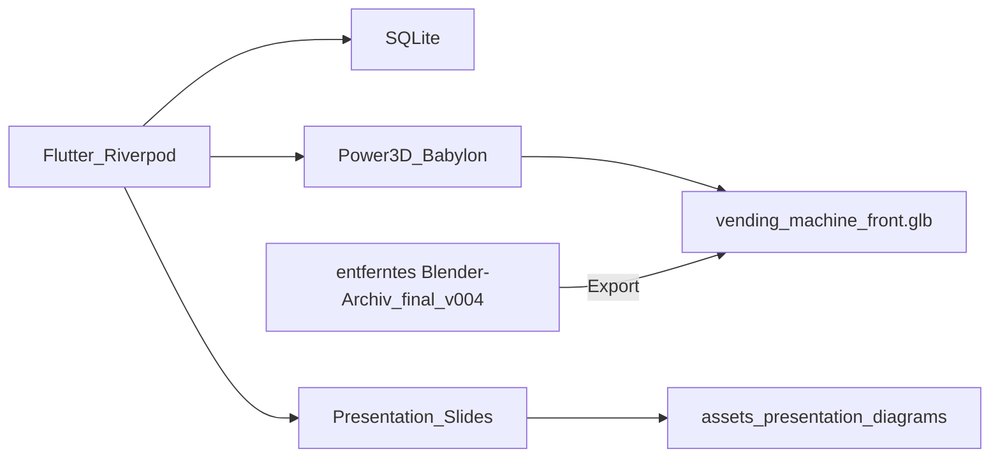
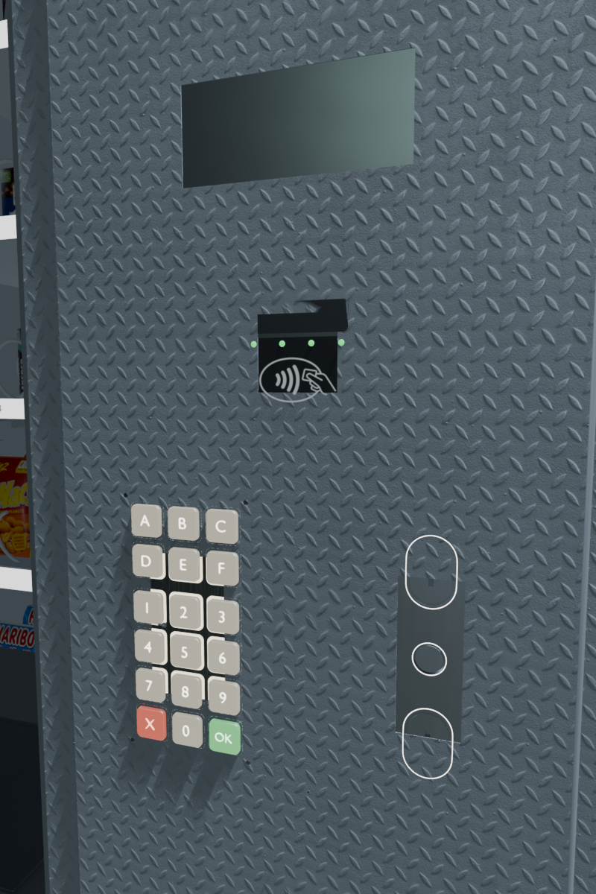
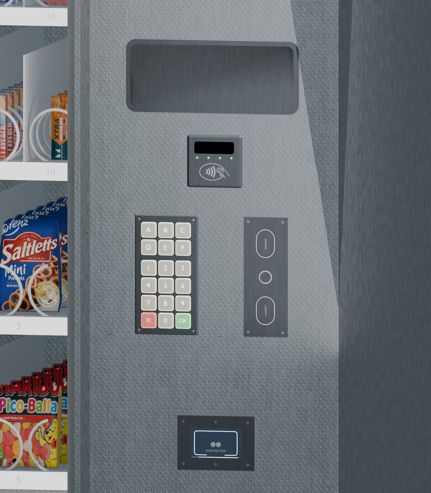

# Control.md – Snackautomat 3D: Architektur, Objekte & Kaufablauf

Zentrale Master-Referenz für das Projekt **snackautomat_yakup_leandro** (`3d_model`): Architektur, Naming, Session-Phasen, 3D-Export, Dispense-Animation und Flutter-Integration.

**Stand:** August 2026 · Master-Blend **`nur noch exportiertes GLB im Repo`** · Export-GLB `assets/models/vending_machine_front.glb` (~85 MB)

**Quellen:** `lib/main.dart`, `lib/features_snack/providers/provider.dart`, `lib/features_snack/screens/vending_machine/vending_machine_3d_landing_screen.dart`, `packages/power3d/lib/src/controller/projection_extension.dart`, `ehem. Blender-Skripte/v5_export_flutter_front_glb.py`.

**Legende:** **IST** = produktiv verdrahtet · **SOLL** = geplant / noch nicht gekoppelt.

**Begleitdocs:** [`Root.md`](Root.md) · [`Dependencies.md`](Dependencies.md) · [`Paths.md`](Paths.md) · [`Presentation.md`](Presentation.md)

---

## 1. Architektur & Laufzeitmodell

```
┌─────────────────────────────────────────────────────────────┐
│  Flutter App (Windows Primär)                               │
│  Riverpod Session + Admin UI + Sidebar + DigitalDisplay     │
│  + Präsentation (presentation/*)                            │
│       │                                                     │
│       ├── SQLite (sqflite / FFI)  Produkte, Slots, Münzen   │
│       │                                                     │
│       └── Power3D (Babylon.js in flutter_inappwebview)      │
│               ├── GLB: vending_machine_front.glb            │
│               ├── Dispense: Elevator → Spirale → Fall       │
│               └── HUD-OLED: DynamicTexture auf UI_HUD_Screen│
└─────────────────────────────────────────────────────────────┘
                          ▲
                          │ einmaliger Export (kein Live-HTTP)
┌─────────────────────────┴───────────────────────────────────┐
│  Blender nur noch exportiertes GLB im Repo                          │
│  ehem. Blender-Skripte/build_* / v5_export_*.py                  │
│  Cursor MCP :9877  = nur Agent-/Dev-Steuerung der Szene     │
└─────────────────────────────────────────────────────────────┘
```



| Kanal | Port / Medium | Zweck |
| --- | --- | --- |
| **App Runtime** | lokal (kein Bridge-Port) | Kauf, Lager, 3D, Flap, Dispense, HUD |
| **Cursor MCP ↔ Blender** | **9877** | Agent-Tools, Viewport, Skript-Runs — **kein** Kauf-Backend |
| **Referenz-Projekt Bridge** | **8765** | Altes V5-Training-Repo — **nicht** in dieser Pipeline |

**Einstieg:** `lib/main.dart` → DB + Power3D-Bootstrap → `VendingMachine3DLandingScreen`.

**Kernaussage:** Die Demo läuft **standalone** (GLB + SQLite). Live-Blender nur für Modellarbeit/Export unter `entferntes Blender-Archiv`.

---

## 2. Domain-Modell

| Typ | Datei | Bedeutung |
| --- | --- | --- |
| **Product** | `models/product/product.dart` | Katalog: Name, `price_cents`, Kategorie, `slotWidth` (1 = A–D, 2 = E–F) |
| **ProductSlot** | `models/product/product_slot.dart` | Belegung: `productId`, Reihe, Spalte, `stockQuantity` → `slotCode` z. B. `A1` |
| **PlacedProduct** | `models/product/placed_product.dart` | Joined-Sicht für UI / 3D-Stock-Sync |
| **Coin / Transaction** | `models/coin`, `models/transaction` | Münzkassette, Einkaufsprotokoll |

### Slot-Matrix (IST)

| Reihen | Spalten | Codes | Hinweis |
| --- | --- | --- |
| A–D | 1–10 | `A1`…`D10` | Ein Spiral-Motor pro Slot |
| E–F | 1–5 (UI) | Dual-Breite | Physisch Spalten **1,3,5,7,9**; beide Spiralen `start` + `start+1` |
| Parser | — | `slot_code_parser.dart` | Commit-Delay ~3 s (z. B. A1→A10) |

---

## 3. Session-Phasen (Riverpod)

Quelle: `enum VendingMachinePhase` in `providers/provider.dart`.

| Phase | Bedeutung | Typische Aktionen |
| --- | --- | --- |
| `ready` | Idle | Slot tippen, Admin |
| `paymentInProgress` | Zahlung offen | Münzen, Cancel |
| `dispensing` | Ausgabe | Stock −1, Wechselgeld, 3D `dispenseItem` |
| `thankYou` | Abschluss | Typwriter, dann `ready` |
| `outOfService` | Fehler / kein Wechselgeld | Admin-Reset |

**Kaufablauf (IST):**

```
ready → Slot (A–F, 1–10 / E–F Dual)
     → paymentInProgress → Münzen bis Preis
     → dispensing → ChangeCalculator + DB
                  → dispenseAnimationHandler
                       → applyVendingCameraView('dispense')
                       → dispenseItem(slot, visibleStock, 5600 ms)
                       → setDeliveryFlapOpen(true)
     → thankYou → ready
```

**HUD-Spiegelung (IST):** Landing `_syncHudOled` mappt `VendingMachinePhase` → `updateVendingHudOled` auf Mesh `*HUD_Screen*` (DynamicTexture). Parallel: 2D-`DigitalDisplay` (SNACK-OLED).

| Phase | HUD-Payload (vereinfacht) |
| --- | --- |
| `ready` | `idle` / `typing` / `selected` |
| `paymentInProgress` | `payment` |
| `dispensing` | `dispensing` |
| `thankYou` | `success` |
| `outOfService` | `outOfService` |


---

## 4. 3D-Landing & Steuerung (Flutter)

Datei: `vending_machine_3d_landing_screen.dart`

| Feature | IST |
| --- | --- |
| Modell | `assets/models/vending_machine_front.glb` (`modelAsset`) |
| Viewer-Lock | `ProductModelViewerLock` — **eine** Power3D-Instanz |
| Sidebar | `VendingControlSidebar` |
| 2D-Fallback | `VendingMachineScreen` |
| Admin | `AdminAccess` (PIN in `admin_access.dart`) |
| Presentation | `ensureVendingPresentation` + `stabilizeVendingShelf` |

### Kamera-Presets

| id | Label | Orbit-Lock |
| --- | --- | --- |
| `front` | Front Ortho | ja |
| `front3d` | 3D Front | nein |
| `buy` | Tastenfeld & Münzen | ja |
| `product` | Product View | ja |
| `dispense` | Produktausgabe | ja |

### Material-Styles

| id | Label |
| --- | --- |
| `blender_dark` | Blender dunkel — **Default** |
| `blender` | Blender hell / Studio |
| `studio_metal` | Studio-Metall |
| `enamel` | Dunkles Email |
| `matte` | Matt |

### Interaktionen IST vs SOLL

| Element | IST | SOLL |
| --- | --- | --- |
| Dispense-Sequenz | Elevator + Spirale + Fall + PUSH-Blink | Sound / feinere Physik |
| Delivery-Flap | Hover öffnet; nach Dispense collect; inward hinge | — |
| Stock-Sichtbarkeit | `syncVendingStock` → `Product_*_s00…` | — |
| HUD-OLED | Phase → DynamicTexture | ePort Live-Screen |
| Slot/Keypad | Flutter-Sidebar | Raycast `KP_Key_*` |
| CoinMod | Visuell im GLB | Münz-Einwurf-Animation |
| Live-Blender | — | optional Bridge `:8765` |
| Präsentation | 14 Folien in App + Next.js `page/` | — |


---

## 5. Dispense-Sequenz (Power3D / Babylon)

Default-Dauer **~5600 ms**. JS: `dispenseVendingItem` · Dart: `dispenseItem`.

| Schritt | Aktion |
| --- | --- |
| 1 | Aufzug (`Elevator_WideBasket*`) fährt zur Reihe |
| 2 | Spirale(n) drehen ~1,5 Umdrehungen (`rotateAround` um Coil-Achse) |
| 3 | Produkte im Slot leichter Vorschub (~0,06 Z) |
| 4 | Vorderstes Produkt fällt in den Korb (PET+Label+Cap zusammen) |
| 5 | Aufzug + Cargo nach unten → `resetElevatorHome` |
| 6 | PUSH-Lettering blinkt 3× |
| danach | Dart: `setDeliveryFlapOpen(true)` zum Entnehmen |

### Naming Dispense-Meshes

| Pattern | Beispiel | Rolle |
| --- | --- | --- |
| `Product_{R}{CC}_s{SS}` | `Product_A01_s00` | Produkt-Stack (s00 = vorne) |
| `Motor_{R}{C}_Spiral` | `Motor_A1_Spiral` | Spirale (exakter Col-Match) |
| `Elevator_WideBasket` / `_Floor` / `_Wall` | | Korb (Root fährt; Kinder mit) |
| `*DeliveryFlap_Door*` | | Entnahmeklappe + PUSH |

### Stabilitätsregeln (kritisch)

| Regel | Warum |
| --- | --- |
| GLB-Bake: lokale **Identity** unter `__root__` | Verts schon am Slot |
| **Nie** `setParent(null)` auf Product/Spiral | glTF-Y-up-Rotation geht verloren → Drift / Orbit |
| Spirale: `rotateAround` von Home-Pose | sonst Schleudern um Maschinenmitte |
| Nur Elevator-**Wurzel** animieren | sonst doppelte Höhe (Parent+Child) |
| `stabilizeVendingShelf()` nach Load | Pose + Spiralen reparieren |

---

## 6. 3D-Objektkatalog & Naming

Export-Filter: `ehem. Blender-Skripte/v5_export_flutter_front_glb.py` (`want()`).

### 6.1 Shell & Gehäuse

| Prefix / Name | Rolle |
| --- | --- |
| `Vending_LeftBody`, `Vending_RightPanel`, `Vending_Roof`, `Vending_Foot_*` | Außenhülle |
| `Vending_GlassPane` | Frontglas (Alpha) |
| `Vending_ControlPanel` | Rechte Bedienplatte |
| `Vending_Interior*` | Innenraum |
| `Divider_*` | Fachtrenner |
| `LabelStrip_*` / `LabelPlate_*` / `LabelText_*` | Beschriftung |

### 6.2 Ausgabe & Aufzug

| Name | Rolle |
| --- | --- |
| `Vending_DeliveryFlap_Door` / `_Frame` | Entnahmeklappe |
| `Vending_DeliveryBay*` / `Vending_LowerFront_*` | Ausgabeschacht |
| `Vending_AntiTheft_*` | Diebstahlschutz |
| `Elevator_WideBasket*` | Fahrender Korb (exportiert) |
| `Elevator_Rail_*` / `Belt_*` / … | Schienen (Laufzeit oft ausgeblendet) |

### 6.3 Spiralen & Produkte

| Pattern | Rolle |
| --- | --- |
| `Motor_{Row}{Col}_Spiral` | Spirale |
| `Motor_*_Base` | Motorfuß |
| `Product_{Row}{Col2}_s{Stack}` | Produkt-Einheit (ggf. MultiMaterial PET/Label/Cap) |

### 6.4 Metal Keypad (`KP_*`)

| Objekt | Notes |
| --- | --- |
| `KP_Keypad` | Root |
| `KP_Plate` | Platte |
| `KP_Key_*` | A–F, 0–9, X, OK |
| `KP_Halo_*` / `KP_Label_*` / `KP_Screw_*` | Glow, Glyphs, Schrauben |

### 6.5 ePort (`EPort_*`)

| Objekt | Notes |
| --- | --- |
| `EPort_Body` | Atlas |
| `EPort_Screen` | Platzhalter — Flutter-dynamisch vorgesehen |
| `EPort_CardSlot`, `EPort_CompleteButton`, `EPort_LED_*` | Detail |

### 6.6 CoinMod / CoinReturn

| Prefix | Rolle |
| --- | --- |
| `CoinMod_*` | Münzmodul (LED-Curves **nicht** im Flutter-GLB) |
| `CoinReturn_*` | Rückgabe (`build_coin_return_v4.py`) |





### 6.7 HUD

| Prefix | Rolle |
| --- | --- |
| `UI_HUD_Screen` | OLED DynamicTexture (IST) |
| `UI_HUD_Frame` / `UI_HUD_Glass` | Rahmen / Cover |
| `Right_Display_*` | rechtes Display |

---

## 7. Export-Pipeline (Blender → Flutter)

```
nur noch exportiertes GLB im Repo
        │  Shell-PBR, KP, ePort, CoinMod, CoinReturn, Flap, Elevator park
        ▼
ehem. Blender-Skripte/v5_export_flutter_front_glb.py
        │  want()-Filter · Relocate Origin→Maschine (temporär)
        │  World-Bake → Identity · Material-Tuning Babylon
        │  Elevator park_local_z · CoinMod_LED ausgeschlossen
        ▼
assets/models/vending_machine_front.glb  (~85 MB)
        ▼
Power3D: ensureVendingPresentation → stabilizeVendingShelf → Sync/Dispense
```

**Kanonische Skripte** (alle unter `ehem. Blender-Skripte/`):

| Skript | Zweck |
| --- | --- |
| `v5_export_flutter_front_glb.py` | GLB-Export |
| `v5_fix_shading_artifacts.py` | N-Gon / Shading |
| `v7_apply_polyhaven_shell_pbr.py` | Shell-PBR |
| `build_metal_keypad.py` | Keypad |
| `build_eport_terminal.py` | ePort |
| `rebuild_coinmod_v7_front_dishes.py` | CoinMod |
| `fix_coinmod_slots.py` | Slot-Wells |
| `build_coin_return_v4.py` | Coin Return |
| `apply_flap_kp_design.py` | Flap PUSH |

**Roh-Assets** für Builds: `ehem. Roh-Assetsmetal_keypad/`, `eport_terminal/`, `coinmod/`, `textures/`.

---

## 8. Power3D-API (relevant)

Dart → JS Eval in `packages/power3d`.

| Call | Wirkung |
| --- | --- |
| `ensureVendingPresentation()` | Lights, Glas, Flat-Shading, Homes |
| `stabilizeVendingShelf()` | Product/Spiral unter `__root__` + Bake-Pose |
| `applyVendingCameraView(id)` | Kamera-Preset |
| `applyVendingMaterialStyle(id)` | Material-Look (`blender_dark` default) |
| `setOrbitLock(bool)` | Orbit sperren |
| `setDeliveryFlapOpen(bool)` | Klappe |
| `syncVendingStock(Map)` | Sichtbare Stacks je Slot |
| `dispenseItem(slot, visibleStock:)` | volle Ausgabe-Sequenz |
| `resetElevatorHome()` | Aufzug Park |
| `updateVendingHudOled(payload)` | HUD DynamicTexture |
| `collectDispensedProduct()` | Mesh nach Entnahme ausblenden |

---

## 9. Checkliste steuerbarer Elemente

| Element | Steuerbar IST | Sichtbar im GLB |
| --- | --- | --- |
| Kamera / Materialien | UI | — |
| Delivery-Flap | Hover + Dispense | ja |
| Elevator / Spiralen | Dispense-Sequenz | ja |
| Stock / Produkte | Sync + Dispense | ja |
| HUD-OLED | Phase-Sync | ja |
| Keypad | Sidebar (nicht Mesh-Hit) | ja |
| CoinMod / CoinReturn | — | ja |
| ePort Screen Live | — | Platzhalter |
| Admin | ja (PIN) | — |
| Präsentation | ja (PIN, `presentation_access.dart`) | — |

---

## 10. Schnellreferenz Prefixes

```
Vending_*          Shell, Panel, Flap, Bay, Interior
KP_*               Metal Keypad
EPort_*            Payment Terminal
CoinMod_*          Münzmodul
CoinReturn_*       Rückgabe
Motor_*_Spiral     Spiralen
Product_*_s**      Produkte (Stack)
Elevator_WideBasket*  Aufzug-Korb
Divider_*          Trenner
Label*             Beschriftung
UI_HUD_*           HUD / OLED
AntiTheft_*        Diebstahlschutz
```

---

## 11. Visuelle Belege

| Datei | Thema |
| --- | --- |
| `install/previews/coinmod_preview.png` | CoinMod |
| `install/previews/coinmod_slots_fix.png` | Slot-Detail |
| `install/previews/panel_cr_design.png` | Panel + Coin Return |
| `install/previews/machine_kp_design.png` | Keypad an Maschine |
| `install/previews/flap_kp_design.png` / `flap_push_check.png` | Delivery-Flap |
| `install/previews/hud_*.png` / `glass_screen_fix.png` | Display / Glas |

---

## 12. Verwandte Doku

- [`Dependencies.md`](Dependencies.md) — Pakete, Plattformen, Setup
- [`Root.md`](Root.md) — Verzeichnisbaum
- [`Paths.md`](Paths.md) — Datei-Verknüpfung & Runtime-Pfade
- [`Presentation.md`](Presentation.md) — Folien, Demo, Learnings

PDF regenerieren: `python install/generate_pdf.py`
