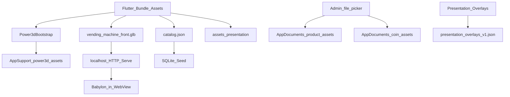
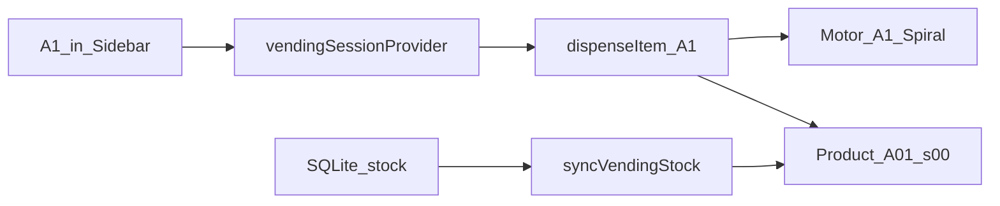
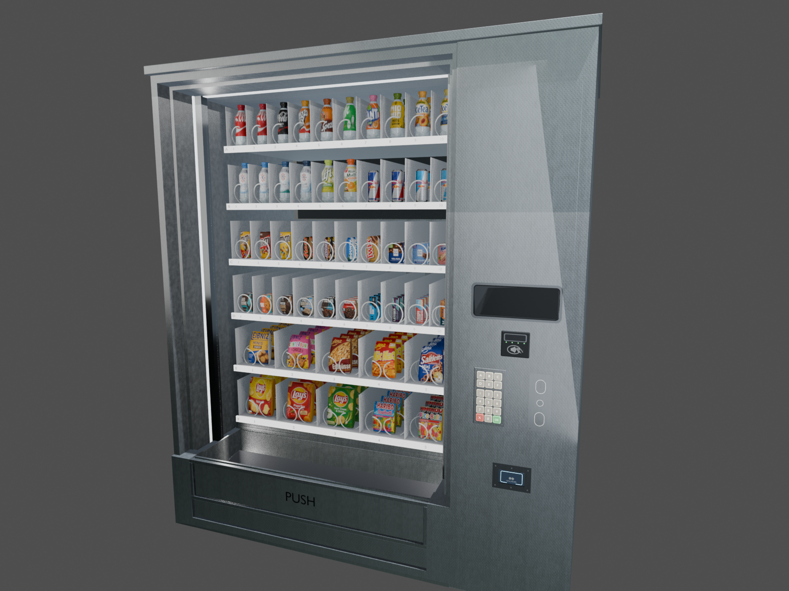

# Paths.md – Datei-Verknüpfung, Bundle- & Runtime-Pfade

Zentrale Referenz: **welche Datei wohin gehört**, wie Assets verknüpft werden und welche Pfade zur Laufzeit entstehen.

**Stand:** August 2026 · App `snackautomat_yakup_leandro`

**Begleitdocs:** [`Root.md`](Root.md) · [`Control.md`](Control.md) · [`Dependencies.md`](Dependencies.md) · [`Presentation.md`](Presentation.md)

---

## 1. Asset-Flow (Überblick)

```
Bundle (pubspec assets)
        │
        ├── assets/models/vending_machine_front.glb
        │         → Landing modelAsset → Kopie unter power3d_assets/models/
        │         → Serve http://127.0.0.1:<port>/… → Babylon
        │
        ├── assets/products/catalog.json + <slug>/
        │         → product_catalog_assets.dart (isBundleAssetPath = startsWith "assets/")
        │
        ├── assets/presentation/diagrams/ + brand/
        │         → slides.dart (Folien) · slide_widgets.dart (Branding)
        │
        └── packages/power3d/assets/power3d_assets.zip
                  → Power3dBootstrap → ApplicationSupport/power3d_assets/
```



---

## 2. Bundle-Assets (im Repo / APK)

| Kategorie | Pfad | Nutzung |
| --- | --- | --- |
| Automaten-GLB | `assets/models/vending_machine_front.glb` | `VendingMachine3DLandingScreen.modelAsset` (~85 MB) |
| Produktkatalog | `assets/products/catalog.json` | `productCatalogAssetPath` → Seed |
| Produkt-Ordner | `assets/products/<slug>/` | `preview.png`, `model.glb` u. a. (47 Slugs in pubspec) |
| Katalog-Felder | `model_asset` / `image_asset` | z. B. `assets/products/coca_cola_original/model.glb` |
| Bundle-Check | Pfad beginnt mit `assets/` | `isBundleAssetPath()` in `product_catalog_assets.dart` |
| Präsentation | `assets/presentation/diagrams/*.png` | Folien in `slides.dart` |
| Branding | `assets/presentation/brand/*.png` | Emblem / Marble-Hintergründe |

`pubspec.yaml` listet GLB, `catalog.json`, Präsentations-Ordner und jeden Produkt-Slug einzeln unter `flutter.assets`.

---

## 3. Power3D-Runtime (Application Support)

| Was | Pfad | Code |
| --- | --- | --- |
| ZIP-Quelle | `packages/power3d/assets/power3d_assets.zip` | `Power3dBootstrap._zipPath` |
| Entpack-Ziel | `{getApplicationSupportDirectory()}/power3d_assets/` | `Power3dBootstrap` |
| Index | `…/power3d_assets/index.html` | Bootstrap-Check |
| Babylon | `…/power3d_assets/babylon/babylon.js` | Bootstrap-Check |
| Tooltip-JS | `…/power3d_assets/js/annotation/styles/tooltip.js` | Bootstrap-Check |
| Großes GLB | Kopie unter `…/power3d_assets/models/` | Serve über Local-HTTP (kein `file://`) |

**Warum Local-HTTP?** WebView2/`file://`-Einschränkungen bei großen GLBs — Viewer lädt über `http://127.0.0.1:<port>/…`.

**Typischer Windows-Pfad (Beispiel):**

```
C:\Users\<user>\AppData\Roaming\<org>\<app>\power3d_assets\
```

Exakter Pfad hängt vom Package-Namen und der Plattform ab — zur Laufzeit in Debug-Ausgabe von `Power3dBootstrap` sichtbar.

---

## 4. Persistente Admin-Uploads (Application Documents)

| Typ | Basis-Pfad | Code |
| --- | --- | --- |
| Produktbilder/-modelle | `{getApplicationDocumentsDirectory()}/product_assets/{images\|models}/<timestamp>/` | `ProductAssetStorage` |
| Münz-Designs | `{getApplicationDocumentsDirectory()}/coin_assets/<timestamp>/` | `CoinAssetStorage` |
| Managed-Check | Pfad muss unter `product_assets` bzw. `coin_assets` liegen | sonst beim Speichern kopieren |
| Cache | `LocalFileCache` | `existsSync`-Caching |

Unterstützte Modell-Formate (Admin): `.glb` / `.gltf` / `.obj` (+ Companion-Dateien bei Bedarf).

**Typischer Windows-Pfad (Beispiel):**

```
C:\Users\<user>\Documents\product_assets\images\<timestamp>\image.png
C:\Users\<user>\Documents\coin_assets\<timestamp>\coin.png
```

---

## 5. SQLite-Datenbank

| Was | Pfad | Code |
| --- | --- | --- |
| Dateiname | `snackautomat.db` | `db_creater.dart` |
| Verzeichnis | `{getDatabasesPath()}/` | sqflite (plattformabhängig) |
| Schema-Version | 10 | `migrations.dart` → `migration_001…010` |
| Seed | `assets/products/catalog.json` | beim ersten `onCreate` |

**Typischer Windows-Pfad (Beispiel):**

```
C:\Users\<user>\AppData\Roaming\<org>\<app>\databases\snackautomat.db
```

Zur Laufzeit in der Debug-Konsole: `SQLite-Datenbank: …` aus `DbCreater`.

---

## 6. Präsentation (Application Support)

| Was | Pfad | Code |
| --- | --- | --- |
| Overlay-JSON | `{getApplicationSupportDirectory()}/presentation_overlays_v1.json` | `PresentationStore` |
| Folien-Daten | Bundle: `assets/presentation/` | `slides.dart` |
| Einstieg | PIN-Dialog | `presentation_access.dart` (PIN-Konstante in `admin_access.dart`) |

---

## 7. Code → Datei-Verknüpfung (Einstieg)

| Rolle | Datei |
| --- | --- |
| App-Start | `lib/main.dart` |
| 3D-Landing + `modelAsset` | `lib/features_snack/screens/vending_machine/vending_machine_3d_landing_screen.dart` |
| Session / Phasen | `lib/features_snack/providers/provider.dart` |
| Bootstrap | `lib/features_snack/services/power3d_bootstrap.dart` |
| Katalog | `lib/features_snack/services/product_catalog_assets.dart` |
| Produkt-Uploads | `lib/features_snack/services/product_asset_storage.dart` |
| Münz-Uploads | `lib/features_snack/services/coin_asset_storage.dart` |
| Stock → 3D | `lib/features_snack/services/vending_stock_sync.dart` |
| Admin-PIN | `lib/features_snack/services/admin_access.dart` |
| Präsentation | `lib/features_snack/presentation/presentation_screen.dart` |
| Dispense / HUD API | `packages/power3d/lib/src/controller/projection_extension.dart` |
| Kamera | `packages/power3d/lib/src/controller/view_extension.dart` |

---

## 8. Mesh-Naming ↔ Slot (3D-Verknüpfung)

| Konzept | Pattern | Beispiel |
| --- | --- | --- |
| Produkt-Stack | `Product_{R}{CC}_s{SS}` | `Product_A01_s00` |
| Spirale | `Motor_{R}{C}_Spiral` | `Motor_A1_Spiral` |
| Aufzug | `Elevator_WideBasket*` | Root fährt |
| Klappe | `Vending_DeliveryFlap_Door` | Entnahme |
| HUD | `UI_HUD_Screen` | OLED DynamicTexture |
| Keypad | `KP_*` | visuell; Raycast SOLL |
| ePort | `EPort_*` | visuell |

### Slot-Code ↔ Mesh-Spalte

| UI-Code | Mesh-Spalte (2-stellig) | Motor-Name |
| --- | --- | --- |
| `A1` | `01` | `Motor_A1_Spiral` |
| `C4` | `04` | `Motor_C4_Spiral` |
| `E3` (Dual) | `03` + `04` | `Motor_E3_Spiral` + `Motor_E4_Spiral` |

Slot-Code UI `A1` ↔ Mesh `Product_A01_s00` — Details in [`Control.md`](Control.md).



---

## 9. Dev-Pipeline-Pfade (`entferntes Blender-Archiv`)

| Artefakt | Pfad |
| --- | --- |
| Master-Blend | `nur noch exportiertes GLB im Repo` |
| Export-Skript | `ehem. Blender-Skripte/v5_export_flutter_front_glb.py` |
| Shading-Fix | `ehem. Blender-Skripte/v5_fix_shading_artifacts.py` |
| Ziel-GLB (App) | `assets/models/vending_machine_front.glb` |
| Roh-Assets | `ehem. Roh-Assetsmetal_keypad/`, `eport_terminal/`, `coinmod/`, `ehem. Texturen` |
| MCP-Historie | `ehem. MCP-Historie` |
| PolyHaven | `ehem. PolyHaven` |

Diese Pfade sind **kein** App-Runtime — nur Modellpflege.

**Export-Kette:**

```
nur noch exportiertes GLB im Repo
    → ehem. Blender-Skripte/v5_export_flutter_front_glb.py
    → assets/models/vending_machine_front.glb
    → flutter run -d windows
```

---

## 10. Doku- & Tool-Pfade

| Was | Pfad |
| --- | --- |
| Markdown / PDF | `install/*.md`, `install/*.pdf` |
| Preview-Bilder | `install/previews/*.png` (14 Dateien) |
| PDF-Generator | `python install/generate_pdf.py` |
| Cursor-SDK Regen | `install/regen/` (`npx tsx src/regen-docs.ts`) |
| Next.js Präsentation | `page/` → `npm run dev` |

---

## 11. Visuelle Belege




---

## 12. Verwandte Doku

- [`Root.md`](Root.md) — Verzeichnisbaum
- [`Control.md`](Control.md) — Architektur & Dispense
- [`Dependencies.md`](Dependencies.md) — Pakete & Setup
- [`Presentation.md`](Presentation.md) — Demo

PDF regenerieren: `python install/generate_pdf.py`
