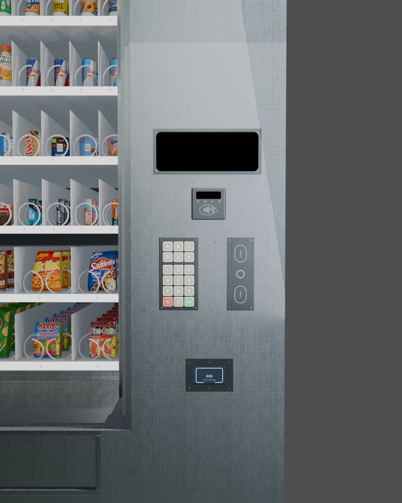

# Root.md – Projektbaum & Datei→Rolle

Navigationskarte der Codebasis **snackautomat_yakup_leandro** (`3d_model`).

**Stand:** August 2026 · App-Runtime standalone · GLB `assets/models/vending_machine_front.glb` (~85 MB)  
Blender-Master/Export-Skripte wurden aus dem Repo entfernt; die App nutzt nur das exportierte GLB.

**Begleitdocs:** [`Control.md`](Control.md) · [`Dependencies.md`](Dependencies.md) · [`Paths.md`](Paths.md) · [`Presentation.md`](Presentation.md)

---

## 1. Verzeichnisbaum (aktueller Disk-Stand)

### 1.1 Runtime (aktiv)

```
3d_model/
├── README.md                             ← Produktübersicht & Quickstart
├── pubspec.yaml                          ← snackautomat_yakup_leandro 1.0.0+1
├── analysis_options.yaml
├── install/                              ← diese Dokumentation
│   ├── Root.md / Root.pdf
│   ├── Control.md / Control.pdf
│   ├── Dependencies.md / Dependencies.pdf
│   ├── Paths.md / Paths.pdf
│   ├── Presentation.md / Presentation.pdf
│   ├── generate_pdf.py
│   ├── previews/*.png                    ← QA-Screenshots (14 Dateien)
│   └── regen/                            ← Cursor-SDK Doku-Regen
├── lib/
│   ├── main.dart                         ← Entry: DB + Power3D → 3D-Landing
│   └── features_snack/
│       ├── constants/                    ← Münz-Konfiguration
│       ├── models/                       ← product, coin, transaction (Freezed)
│       ├── providers/provider.dart       ← VendingMachinePhase, Kauf, Wechselgeld
│       ├── repositories/                 ← DB + migrations 001…010
│       ├── services/                     ← Bootstrap, Stock, Assets, Parser, …
│       ├── presentation/                 ← In-App-Folien (14 Slides, Overlay-Editor)
│       ├── screens/
│       │   ├── vending_machine/          ← 3D-Landing + Controls + 2D-UI
│       │   └── admin/                    ← Produkte, Slots, Refill, Münzen
│       └── widgets/
├── packages/
│   └── power3d/                          ← Babylon Viewer (path, 2.3.1)
│       ├── assets/power3d_assets.zip
│       └── lib/src/controller/
│           ├── projection_extension.dart ← Dispense, Elevator, Flap, HUD, Stock
│           ├── view_extension.dart       ← Kamera-Presets
│           └── …                         ← material, animation, selection, …
├── assets/
│   ├── models/vending_machine_front.glb  ← Flutter-3D (~85 MB)
│   ├── products/                         ← catalog.json + Produkt-Ordner (47 Slugs)
│   └── presentation/
│       ├── diagrams/                     ← Architektur-, Slot-, Naming-Diagramme
│       └── brand/                        ← Folien-Branding (Emblem, Marble)
├── windows/                              ← Primärer Desktop-Runner
├── test/                                 ← Unit-/Widget-Tests
└── page/                                 ← Next.js Präsentations-Website
```

### 1.2 Entferntes Blender-Archiv

Der frühere Ordner mit Master-Blend, bpy-Skripten und Roh-Assets wurde **gelöscht**, um Speicher freizugeben. Die App läuft standalone über ssets/models/vending_machine_front.glb.

`mermaid
flowchart TB
  root[3d_model]
  root --> runtime[Runtime]
  root --> docs[install]
  runtime --> lib[lib]
  runtime --> p3d[packages/power3d]
  runtime --> assets[assets/models + products + presentation]
  runtime --> win[windows]
  runtime --> page[page]
`

---

## 2. Flutter – Screens & Zuständigkeit

| Datei | Rolle |
| --- | --- |
| `vending_machine_3d_landing_screen.dart` | **3D-Landing**: GLB, Kameras, Materialien, Flap, Dispense, HUD-OLED, Sidebar |
| `vending_control_sidebar.dart` | Rechte Bedienung am 3D-Screen |
| `vending_control_front.dart` | Front-Control-Variante |
| `vending_machine_screen.dart` | 2D-Fallback-UI |
| `vending_hud_display.dart` | HUD-Spiegelung (2D) |
| `slot_keypad.dart` / `key_button.dart` | Tastenfeld |
| `digital_display.dart` / `coin_slot.dart` / `change_output.dart` | SNACK-OLED, Münzen, Wechselgeld |
| `control_panel.dart` / `vending_*_panel.dart` | Panel-Zusammensetzungen |
| `input_and_coin_panel.dart` / `product_output.dart` | Eingabe- und Ausgabe-Bereich |
| `product_area.dart` / `product_row.dart` / `product_tile.dart` / `empty_slot.dart` | Produktgitter |
| `admin/admin_screen.dart` | Admin-Shell |
| `admin/admin_products_panel.dart` | Katalog |
| `admin/admin_slots_panel.dart` | Slot-Belegung |
| `admin/admin_product_refill_panel.dart` | Nachfüllen |
| `admin/admin_coin_inventory_panel.dart` | Münzbestand |

### Präsentation (In-App)

| Datei | Rolle |
| --- | --- |
| `presentation/slides.dart` | 14 Folien (`kPresentationSlides`), Diagramm-Pfade |
| `presentation/presentation_screen.dart` | Folien-Viewer + Overlay-Editor |
| `presentation/presentation_access.dart` | PIN-geschützter Einstieg (`openPresentationArea`) |
| `presentation/presentation_store.dart` | Overlay-Persistenz → Application Support |
| `presentation/slide_widgets.dart` | Rendering je Folientyp |
| `presentation/slide_editor.dart` | Overlay-Bearbeitung |
| `presentation/hold_nav.dart` | Hold-to-Navigate (3 s vorwärts, Doppelklick+rückwärts) |
| `presentation/overlay_models.dart` | Overlay-Datenmodell |

### SQLite & Repositories

| Datei | Zuständigkeit |
| --- | --- |
| `repositories/db_creater.dart` | `snackautomat.db` via `getDatabasesPath()` |
| `repositories/migrations/migration_001…010` | Schema-Evolution (aktuell v10) |
| `repositories/product_repository.dart` | Katalog + Slots |
| `repositories/coin_repository.dart` | Münzkassette |
| `repositories/transaction_repository.dart` | Einkaufsprotokoll |

### Services (Kern)

| Datei | Zuständigkeit |
| --- | --- |
| `power3d_bootstrap.dart` | ZIP entpacken → Application Support |
| `vending_stock_sync.dart` | PlacedProduct → Stock-Map für 3D |
| `change_calculator.dart` | Wechselgeld |
| `slot_code_parser.dart` | A1–F10 / Dual E–F |
| `product_catalog_assets.dart` | `assets/products` + `isBundleAssetPath` |
| `product_asset_storage.dart` | Admin-Uploads → `product_assets/` |
| `coin_asset_storage.dart` | Münz-Designs → `coin_assets/` |
| `local_file_cache.dart` | existsSync-Cache |
| `admin_access.dart` | Admin-Zugang (PIN-Konstante) |

### Provider

| Datei | Zuständigkeit |
| --- | --- |
| `providers/provider.dart` | `VendingMachinePhase`, Session, Repos, Kauf/Dispense |

### Power3D (Kern-API)

| Datei | Zuständigkeit |
| --- | --- |
| `projection_extension.dart` | `dispenseItem`, Elevator, Spirale, Flap, Stock, HUD, `stabilizeVendingShelf` |
| `view_extension.dart` | `applyVendingCameraView` |
| `material_extension.dart` | Material-Styles |
| `asset_manager.dart` | Asset-Serve / Pfade |

---

## 3. Blender-Pipeline (nicht mehr im Repo)

Export und Master-Szene liegen **nicht** mehr in diesem Repository. Historisch: inal_v004.blend → 5_export_flutter_front_glb.py → ssets/models/vending_machine_front.glb.

Für neue Modelländerungen: lokal außerhalb des Repos arbeiten und das GLB erneut nach ssets/models/ legen.

---

## 4. Datenfluss Kauf (ohne Live-Bridge)

```
VendingControlSidebar / Keypad-Widgets
    → vendingSessionProvider (Riverpod)
        → Slot validieren, Phase paymentInProgress
        → Münzen / ChangeCalculator
        → Repositories (Stock, Coins, Transaction)
        → Phase dispensing
            → dispenseAnimationHandler
                → Power3D.applyVendingCameraView('dispense')
                → Power3D.dispenseItem(slot, visibleStock, 5600)
                    → Elevator hoch → Spirale → Push → Fall
                    → Elevator runter → PUSH blinkt
                → setDeliveryFlapOpen(true)
        → thankYou → ready

Parallel:
  placedProductsProvider → syncVendingStock
  vendingSessionProvider → updateVendingHudOled (3D) + DigitalDisplay (2D)
```

**Abgrenzung:** Kein `POST :8765/vending`. Blender nur offline (Modell/Export/MCP unter `entferntes Archiv`).

---

## 5. Domänen-Kurzmap

| Konzept | Primäre Dateien |
| --- | --- |
| Produktkatalog | `Product`, `product_repository`, `assets/products/catalog.json` |
| Slot-Lager | `ProductSlot`, Admin Slots/Refill, Migration 010 |
| Session / Phasen | `VendingMachinePhase` in `provider.dart` |
| 3D-Front + Dispense | Landing + `projection_extension.dart` + GLB |
| HUD | Landing `_syncHudOled` + `updateVendingHudOled` |
| Admin | `screens/admin/*`, PIN in `admin_access.dart` |
| Präsentation | `presentation/*`, `assets/presentation/` |
| Pfade / Assets | siehe [`Paths.md`](Paths.md) |

---

## 6. Mesh-Naming (Kurz)

| Pattern | Beispiel |
| --- | --- |
| Produkt | `Product_A01_s00` |
| Spirale | `Motor_A1_Spiral` |
| Aufzug | `Elevator_WideBasket`, `_Floor`, `_Wall` |
| Klappe | `Vending_DeliveryFlap_Door` |
| HUD | `UI_HUD_Screen` |

Details: [`Control.md`](Control.md) §5–6.

---

## 7. Preview-Bilder (`install/previews/`)

| Datei | Thema |
| --- | --- |
| `coinmod_preview.png` | CoinMod Close-up |
| `coinmod_slots_fix.png` | Slot-Wells |
| `panel_cr_design.png` | Panel + Coin Return |
| `panel_flush_check.png` | Panel-Flush-Check |
| `machine_kp_design.png` | Keypad an Maschine |
| `kp_keys_metal.png` / `kp_plate_ref.png` | Keypad-Details |
| `flap_kp_design.png` / `flap_push_check.png` / `flap_before.png` | Delivery-Flap |
| `hud_frame_round.png` / `hud_screen_fix.png` / `glass_screen_fix.png` | HUD / Glas |
| `label_rows_bw.png` | Label-Streifen |




---

## 8. Verwandte Doku

- [`Control.md`](Control.md) — API, Dispense, IST/SOLL
- [`Dependencies.md`](Dependencies.md) — Pakete & Plattformen
- [`Paths.md`](Paths.md) — Datei-Verknüpfung & Runtime-Pfade
- [`Presentation.md`](Presentation.md) — Folien, Demo, Learnings

PDF regenerieren: `python install/generate_pdf.py`
